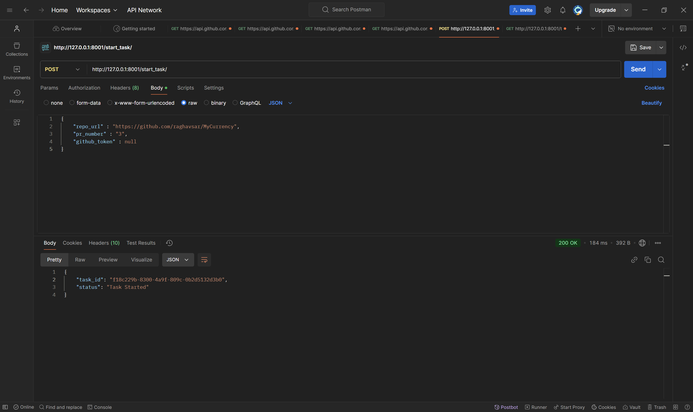

# GitHub-PR-Reviewer

An automated code review system that analyzes pull requests using FastAPI, Django, and LLM (Groq). The system provides detailed feedback on code style, potential bugs, performance improvements, and best practices.

## Features

- Automated PR analysis using LLM
- Real-time status tracking of review progress
- Detailed code feedback including style, bugs, and performance issues
- Asynchronous processing for better performance
- REST API endpoints for integration

## Technology Stack

- FastAPI: API Gateway
- Django: Backend Service
- Celery: Asynchronous Task Processing
- Redis: Task Queue Broker and Caching Layer
- Groq LLM: Code Analysis
- GitHub API: Repository Integration

## Prerequisites

- Python 3.8+
- Redis (for Celery)
- Groq API Key
- GitHub Personal Access Token (optional)

## Installation

1. Clone the repository:
```bash
git clone https://github.com/yourusername/github-pr-reviewer.git
cd github-pr-reviewer
```

2. Create a virtual environment:
```bash
python -m venv venv
source venv/bin/activate  # On Windows: venv\Scripts\activate
```

3. Install dependencies:
```bash
pip install -r requirements.txt
```

4. Set up environment variables:
```bash
cp .env.example .env
# Edit .env file with your configurations:
# GROQ_API_KEY=your_groq_api_key
# GITHUB_TOKEN=your_github_token (optional)
# DJANGO_SECRET_KEY=your_django_secret_key
```

## Configuration

1. Django Settings:
   - Update `django_app/settings.py` with your database configurations
   - Configure Celery broker URL (Redis)

2. FastAPI Settings:
   - Update `DJANGO_API_URL` in `app_fastapi/main.py` if needed

## Running the Application

1. Start Redis server:
```bash
redis-server
```

2. Start Celery worker:
```bash
celery -A django_app worker -l info
```

3. Start Django server:
```bash
python manage.py migrate
python manage.py runserver 8001
```

4. Start FastAPI server:
```bash
uvicorn app_fastapi.main:app --reload --port 8000
```

## System Architecture


The system follows this workflow:
1. Client sends POST request to FastAPI Server
2. FastAPI forwards request to Django REST Framework
3. Django creates a task and stores in Redis
4. Celery Worker processes the task:
   - Fetches PR data from GitHub API
   - Sends code for analysis to Groq LLM
   - Updates task status in Redis
5. Client can check task status through FastAPI

## API Testing Example with Postman

### 1. Starting a PR Review
Send a POST request to initiate the code review:

**Endpoint**: `POST http://127.0.0.1:8001/start_task/`

**Request Body**:
```json
{
    "repo_url": "https://github.com/raghavsar/MyCurrency",
    "pr_number": "3",
    "github_token": null
}
```



### 2. Checking Review Status
Get the status and results of the review:

**Endpoint**: `GET http://127.0.0.1:8001/task_status/f18c229b-8300-4a9f-809c-0b2d5132d3b0/`

**Response Example**:
```json
{
    "task_id": "f18c229b-8300-4a9f-809c-0b2d5132d3b0",
    "status": "SUCCESS",
    "result": {
        "task_id": "bf71a58c-d0a5-4aab-bad5-79abee861091",
        "status": "completed",
        "results": {
            "files": [
                {
                    "name": "fx_rates/admin.py",
                    "issues": [
                        {
                            "type": "style",
                            "line": 3,
                            "description": "Expected import order: standard libraries first, then third-party libraries, and finally internal modules",
                            "suggestion": "Reorder imports according to PEP 8 guidelines"
                        }
                    ]
                }
            ],
            "summary": {
                "total_files": 1,
                "total_issues": 3
            }
        }
    }
}
```


## Example Analysis Results

The system provides detailed feedback on:
- Code style violations
- Import order issues
- Line length problems
- Potential bugs
- Performance improvements
- Best practices recommendations

Each issue includes:
- Type of issue (style, bug, performance, etc.)
- Line number
- Description of the problem
- Suggested fix

## Directory Structure

```
├── app_fastapi/
│   ├── __init__.py
│   └── main.py
├── django_app/
│   ├── django_app/
│   │   ├── __init__.py
│   │   ├── celery.py
│   │   ├── settings.py
│   │   ├── urls.py
│   │   └── wsgi.py
│   └── home/
│       ├── utils/
│       │   ├── ai_agent.py
│       │   └── github.py
│       ├── tasks.py
│       └── views.py
└── requirements.txt
```

## Contributing

1. Fork the repository
2. Create your feature branch (`git checkout -b feature/AmazingFeature`)
3. Commit your changes (`git commit -m 'Add some AmazingFeature'`)
4. Push to the branch (`git push origin feature/AmazingFeature`)
5. Open a Pull Request

## License

This project is licensed under the MIT License - see the [LICENSE](LICENSE) file for details.

## Acknowledgments

- Groq for providing the LLM API
- FastAPI for the high-performance API framework
- Django for the robust backend framework
